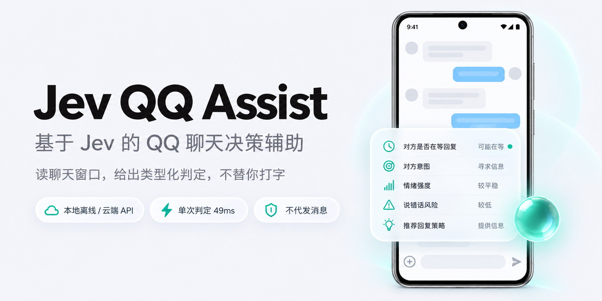
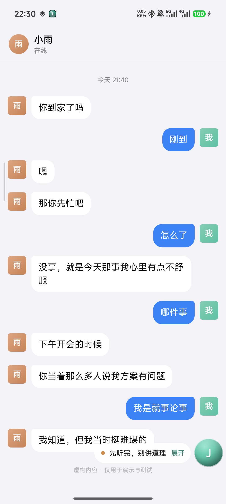
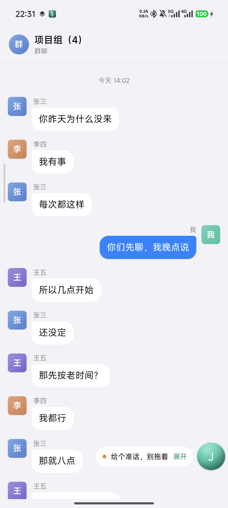

# Jev Wingman

**基于 Jev 的聊天决策辅助。** 装在手机里的聊天参谋：读当前聊天窗口的文字，交给决策模型给出一组**类型化判定**——对方是不是在等你回、他想要什么、情绪多强、这句随便回会不会把事情弄糟、该用哪种策略回。

它只给判决，不替你打字。

**→ [下载 APK](https://github.com/1104480426-hash/jev-wingman/releases/latest)** · 装到手机上就能用，不需要电脑、不需要编译

<sub>English: An on-device chat co-pilot built on Jev's "System One" idea — typed decisions with confidence instead of generated prose. Reads whatever chat window is on screen via Android Accessibility (read-only, never sends), with no package allowlist. Judges locally with a quantized ONNX model or remotely against the real TypeSafe Jev endpoint, and shows a floating verdict card over the chat.</sub>

---

## 它是什么

[TypeSafe AI 的 Jev](https://typesafe.ai) 是一个 "System One" 决策模型：它不写文章，只做**分类、路由、打分**。你给它一段状态和一组带类型的提问（`noul` 是非判断、`choice` 是单选、`score` 是量表），它一次前向就返回全部答案和每个答案的置信度。

Jev 官方是闭源托管服务，**不能本地部署**。它也没有一个开箱即用的聊天客户端。

这个项目要解决的问题很具体：**在手机上跟人聊天时，我需要一个不啰嗦、只给判决的参谋。** 于是它复现了 Jev 的产品形态，而不是它的权重：

- 输入是一段真实的聊天记录，被判定文本始终留在设备上；
- 输出是类型化判定 + 校准过的置信度，**没有一段生成式回复**，因此也没有幻觉需要分辨、没有文本需要解析；
- 判定结果浮在聊天界面上，决定权仍然在人手里。

## 它不是什么

- **不是聊天机器人。** 没有服务端、不接 OneBot、不登录账号、不代收发消息。它是一个前台服务加一个无障碍服务，只读屏幕。
- **不是官方 Jev，也不声称复现了它的精度。** 本地模式的判定内核是 `bge-small-zh-v1.5` 的句向量相似度（见下文），和 TypeSafe 的模型没有任何关系。
- **不会自动回消息。** 代码里没有任何一处发送路径。

## 效果

| 私聊 | 群聊 |
|---|---|
|  |  |

*演示模式下的截图，背景是应用内置的虚构对话页（[私聊](docs/demo-chat.html) / [群聊](docs/demo-chat-group.html)），不含任何真实聊天内容——做法是在 App 里打开对应的演示模式，让读屏读到这一页，再点悬浮球。群聊那一张里每位发言人都带了昵称，这正是 v1.6.0 起改名后的效果。*

**结果分两级显示，这是为了不挡聊天。** 判定完成后默认只留一条贴着悬浮球的胶囊，一行摘要——策略、情绪、风险百分比，左边那个点在高风险时变橙。点它才展开成完整五项判定。聊天时最挡人的就是一大块居中面板，所以默认形态做成最小的那个。

界面按 iOS 的 Liquid Glass 做的：白色毛玻璃、26dp 连续圆角、顶部受光渐变、青绿强调色按钮。**玻璃质感是纯分层实现的，没有用系统模糊**——`FLAG_BLUR_BEHIND` 在 HyperOS 上的作用范围不稳定，同样的窗口参数有时只糊卡片背后、有时糊满全屏把聊天界面一起毁掉，这种偶发代价不值得。

在一台小米 14（Android 16 / Snapdragon 8 Gen 3 / arm64-v8a）上的实测：

| 指标 | 本地模式 | 远端模式（官方 Jev） |
|---|---|---|
| 结果延迟 | 49 – 64 ms | 约 870 ms |
| 模型加载 | 432 ms（一次性） | 无 |
| APK 体积 | 22.3 MB | 同 |
| 需要网络 | 否 | 是 |
| 需要 API key | 否 | 是 |

同一段对话的两次判定对比（对方说「我在办公室没有带平板」）：

```
本地 bge-small-zh                       远端 jev-1.13.0
────────────────────────────────       ─────────────────────────────────
是否在等回复：否  27%                     是否在等回复：是  92%
对方意图：闲聊搭话  30%                    对方意图：表达不满  47%
情绪强度：明显不快  (1.63/3)               情绪强度：明显不快  (1.63/3)
说错话风险：是  64%                       说错话风险：是  85%
推荐回复策略：稍后再说  41%                推荐回复策略：共情安抚  55%
```

**质量差距是真实的，要说清楚。** 官方 Jev 在同一批样本上给的情绪判定明显更贴（它把一段平静的闲聊判成 `calm 0.88`，本地模型会误报「明显不快」），置信度也更有区分度。本地模式的价值在于**离线、零成本、数据不出手机**，不在于它更准。两者在 App 里可随时切换。

## 工作原理

```
当前聊天窗口（QQ / 飞书 / 抖音 / 任意把文字暴露给无障碍的聊天 App）
   │  AccessibilityService 读取节点文本，不设包名白名单
   │  按「昵称紧贴正文上方」认发言人；认不出才退回左右分栏
   ▼
对话转录（最近 N 行，默认 20，可调 2–60）
   │  点击悬浮球触发；全程只读，不注入文本、不点发送
   ▼
┌──────────────────────┬────────────────────────────────┐
│ 本地模式              │ 远端模式                        │
│ bge-small-zh-v1.5    │ POST {endpoint}                │
│ ONNX int8 → 512 维    │ model / state / questions      │
│ 候选向量预编码并缓存   │ 即 Jev 的 /v1/systemone 契约    │
│ 余弦相似度 → softmax  │                                │
└──────────────────────┴────────────────────────────────┘
   ▼
noul / choice / score 三种答案 → 悬浮卡片
```

本地模式的方法是 Jev「读 logits、不生成文本」的一个近似：**一个问题的所有候选里，语义上最贴近当前上下文的那个胜出**，softmax 给出可比较的概率。候选描述在判定前一次性全部编码并缓存，所以真正判定时只算一次上下文向量，这是它能跑进 50 ms 的原因。

### 一条消息在无障碍树里不是一行

这是整条链路里最脏的一段，值得单独说。以实测的一个 QQ 群（1080×2400）为例，屏幕上的四条消息在树里长这样：

| 节点 | top, bottom, left | 长度 | 是什么 |
|---|---|---|---|
| FrameLayout(desc) | 477, 585, 32 | 7 | **头像**，desc 是「张博文的资料卡」 |
| TextView | 477, 521, 161 | 3 | 昵称 |
| TextView | 521, 685, 140 | 2 | 消息正文 |
| TextView | 1394, 1437, 732 | 3 | 群头衔「管理员」 |
| TextView | 1394, 1438, 837 | 5 | 昵称「bello」 |
| TextView | 1438, 1602, 705 | 3 | 消息正文 |
| FrameLayout(desc) | 1394, 1502, 940 | 5 | **自己的头像**，desc 是「我的资料卡」 |

于是清理分四步，顺序不能换：

1. **扔头像**。它的 content-desc 是「某某的资料卡」，七个字起步，靠"短"去认一条也认不出来。管用的判据是位置：头像在屏幕两端（左右各 5% / 13% 边带），最靠近中间的文字纵向与它有交叠就是头像。漏掉右边那一支代价很大——自己的头像会和对面昵称合并，署名直接变成「管理员 bello 我的资料卡」。
2. **合并同一行**。群头衔和昵称是两个 TextView 同一行，不合并的话「管理员」自己会变成一条消息；合并之后昵称变长（实测 13 个字），所以昵称长度上限放到 24——卡在 12 的时候，三人发言的群只能认出一个署名。
3. **扔标题栏**。返回、群名、成员数、聊天设置，整行落在屏幕顶部 11% 以内就丢。**不建词表**，词表换个 App 就废了。11% 这个数是单聊顶部「在线 某某」（底边 246）逼出来的。
4. **配对昵称与正文**。昵称一定比正文矮（低于正文高度 85%）且更短，跟正文的纵向间距在 0–26 px 之间；末尾带句号问号的排除掉。认出来的昵称写进转录（`张三：…`），让 Jev 自己分辨谁在跟谁说话。

坐标系另有一个 168 像素的坑：`getResources().getDisplayMetrics()` 给读屏服务的高度是 **2232**，而节点坐标是含状态栏的 **2400**。两套混用，标题栏下沿整体偏 168 像素；实测差 **0.5 像素** 就漏掉了那行「在线 某某」。真实高度要用 `WindowManager.getCurrentWindowMetrics()` 取。

## 安装

到 [Releases](https://github.com/1104480426-hash/jev-wingman/releases/latest) 下载 `jev-assist-v1.6.0.apk`，在手机上点开装上就行。**不需要电脑、不需要 Android SDK、不需要编译。**

- Android 8.0 及以上（arm64-v8a），22.3 MB
- **模型已经打进 APK 里**，装完离线可用
- 用调试密钥签名，安装时系统会提示来源不明，允许即可

**装好后授权两项**（系统不允许 App 静默拿到，界面上各有一个按钮引导）：

1. **悬浮窗权限** —— 需要「显示在其他应用上层」。
2. **无障碍服务** —— 打开「Jev 僚机 · 读取聊天内容」，用于读取聊天窗口文字。它只读：不注入输入、不点击发送、不代发任何消息。

想先确认装好了没有，点「查看演示模式 · 私聊」或「查看演示模式 · 群聊」：它用一段内置的虚构对话把整条链路跑一遍，不碰任何真实聊天记录，也方便自己截图发帖。两个入口的区别只在排版——私聊是一对一、没有昵称行的气泡，群聊每条消息上方带昵称，和真实的两种界面一致。

**默认走远端**（TypeSafe 官方端点），因为它的判定质量明显更好。没填 API Key 时会自动降级用手机里的本地模型，填上之后自动切回远端——所以刚装好、手上没有 key，也能立刻试。API Key 只写进设备的 SharedPreferences，不进源码、不进仓库。

然后切到聊天窗口停一下，点悬浮球，卡片给出判定。

交互就一个开关：**悬浮球**。每次点它把状态推进一格——

```
无 ──点──> 判定中 ──> 胶囊 ──点──> 展开详情 ──点──> 无
```

点一次球出结果，默认收成贴在球旁边的一条胶囊，几乎不占聊天区；再点一次展开完整判定；再点一次全部收起。卡片上因此没有「收起」按钮，展开和收起都归球管。判定在跑的时候标题会动，因为本地模型首次加载要几秒。

**胶囊和卡片都挂在球上。** 拖动悬浮球时它们跟着走，球吸附到屏幕边缘时还会自动换到背向屏幕中心的那一侧，不会跑出屏幕。卡片可以单独拖到你喜欢的位置，记住的是**相对球的偏移**而不是绝对坐标——所以球以后挪到哪，卡片都按同样的相对关系跟过去。

**判定记的是你点球那一刻的画面。** 结果连同来源 App 和时间一起存下来，之后切到设置页看到的仍然是刚才那个 QQ 群的内容，不会被前台 App 的窗口覆盖成"最近读自 桌面"。设置页会标出这是几分钟前读的。

判定结果可以点「复制」拿走。API Key 不会回填到设置界面上——那个页面很容易被截图，字段留空即表示沿用已保存的值。

## 从源码构建

想改判定描述、换模型或自己接一个后端时用这条路。

**要求**：Windows、Android SDK（build-tools 34、platform android-34）、JDK 17、Python 3。**不需要 Gradle。**

```powershell
git clone https://github.com/1104480426-hash/jev-wingman.git
cd jev-wingman

# 1. 拉第三方依赖（模型 + ONNX Runtime，不随仓库分发）
powershell -ExecutionPolicy Bypass -File fetch_deps.ps1
# 国内网络加代理：
# powershell -ExecutionPolicy Bypass -File fetch_deps.ps1 -Proxy http://127.0.0.1:7897

# 2. 构建并安装
powershell -ExecutionPolicy Bypass -File build.ps1 -Clean -Install
```

SDK / JDK 不在默认位置时：`build.ps1 -Sdk <path> -Jdk <path>`，或设置 `ANDROID_HOME` / `JAVA_HOME`。

## 判定集

| 键 | 类型 | 判定内容 |
|---|---|---|
| `awaiting_reply` | `noul` | 对方是否正等你回复（不回会被读成已读不回） |
| `intent` | `choice` | 对方意图：提问 / 邀约 / 倾诉 / 抱怨 / 闲聊 / 试探 / 想结束 |
| `tension` | `score` 0–3 | 情绪强度：平静 → 略有不快 → 明显不快 → 已经很生气 |
| `risk` | `noul` | 随便回一句是否容易把事情弄糟 |
| `strategy` | `choice` | 建议策略：共情安抚 / 说明情况 / 幽默化解 / 直接回应 / 稍后再说 / 保持距离 |

远端模式的 questions 用英文（TypeSafe 官方文档明确英文训练最充分，CJK 属于 "handled but not equally well"）；本地模式用中文，因为句向量模型是中文优化的。两套规格共用同一个渲染层。

## 各 App 支持情况

界面文字是走 Android 无障碍树读的，**所以某个 App 能不能用，取决于它愿不愿意把内容暴露给无障碍**——这一条完全不由本项目决定。实测（小米 14 / Android 16，各 App 首页）：

| App | 无障碍节点 | 含文字的节点 | 可用 |
|---|---|---|---|
| QQ | 232 | 28 | ✅ 单聊与群聊均已实测 |
| 飞书 | 220 | 38 | ✅ |
| 抖音 | 247 | 24 | ✅ |
| **微信** | **1** | **0** | ❌ |

**微信读不到。** 它的界面全自绘，整个窗口只暴露 1 个节点、0 个文字——不是本项目的 bug，换谁来读都一样。要支持微信只能改成截图 + OCR，代价是引入识别错误和几百毫秒延迟；聊天文本本来就短，错一个字判定就可能跑偏，所以没有做。设置页的「实际读到」会打印当前抓到的文字，一眼能看出读没读到。

## 已知限制

- **说话人靠几何规律推断，不靠控件语义。** 群聊认「昵称紧贴正文上方、比正文矮、也更短」这三条，一对一退回气泡左右位置。后者是通用兜底，前者在实测的 QQ 群结构上成立——但换一个 App 的排版就可能失效，届时群聊里的人会全部退化成「对方」。这是启发式的固有代价。
- **Jev 对"这句话是不是冲我来的"分辨力有限。** 先前的实测里，同一个群聊场景只改署名方式，紧张度就从 1.99 降到 1.47，方向仍然是偏高的；它并不知道那场争吵跟你没关系。署名能缓解，不能解决。详见 [`docs/jev-behavior-notes.md`](docs/jev-behavior-notes.md)。
- **本地模式的细粒度判定会飘。** 句向量相似度对「情绪强度」这种连续量不敏感，把平静的对话误报成不快的概率不低。粗分类（是否在等回复、有无风险）相对可靠。想要质量就用远端模式。
- **上下文不足时置信度是虚高的。** 只喂最后一句时，Jev 会把一段有争执的对话判成「平静、闲聊」，而且置信度高达 0.92。所以抓到的行数太少时（刚进聊天窗口、对方只发了一句），不要信那个百分比。
- **不做历史积累。** 每次判定都是独立的一次，没有跨会话的上下文或记忆。

## 隐私

- 读屏服务**只读**：它遍历当前窗口的节点取文本，不执行任何 action，不注入输入，不点击发送。
- **本地模式的数据完全不出手机**，判定在设备内完成。
- **远端模式**会把最近 N 行对话作为 `state` 发给所配置的端点（默认是 TypeSafe 官方）。用之前请确认你接受这一点，并按需改成自建服务。
- 调试日志只打印控件类名、坐标、长度和每条文本的**前十个字**，不留完整对话；这个开关默认关。
- 本项目不收集任何遥测。

## 更新日志

### v1.6.0 — 群聊里认得出是谁在说话

- **群聊按昵称署名。** 群里所有人都在屏幕左侧，只按左右位置分栏的话会全部标成「对方」——别人之间的争吵会被判成冲你来的（实测紧张度 1.99，带署名降到 1.47）。现在从无障碍树里认出发言人昵称写进转录（`张三：…`），认不出才退回分栏。QQ 群三人和四人发言的场景实测署名全部正确。
- **判定记住的是你点球那一刻的画面。** 结果连同来源 App 和时间一起存下来。以前切到设置页回看，标题写着「最近读自 com.android.systemui」，转录内容却明明是刚才那个群，两边对不上账。
- **数字消息不再被吞掉。** `9.19`、`3.14`、`666` 这类没有汉字和字母的短消息，之前被当成时间戳噪声过滤掉了。
- **长昵称与群头衔同行合并。** 合并之后昵称上限从 12 放宽到 24 字——卡在 12 的时候，三人发言的群只能认出一个署名。自己的头像也不再并进对面昵称，那会让署名变成「管理员 bello 我的资料卡」。
- **系统提示不再被署成「我」。** 「全员禁言中，仅群主和管理员可发言」这类居中通知，之前会被加上「我：」前缀。
- **默认上下文 12 → 20 行。** 只喂最后一句时，Jev 会把一段有争执的对话判成「平静、闲聊」，置信度却高达 0.92。
- **演示模式分私聊与群聊两个入口**，分别对应一对一和带昵称的群聊排版。
- **APK 包内版本号对上号。** 之前六个 release 的版本一直是 `1.0`，系统「应用信息」页显示的是错的。

### v1.5.0 — 面板更通透

- 玻璃不透明度 96% → 88%，并加深分层。没有背景模糊时，「毛玻璃」的观感其实来自半透明本身：背后的聊天气泡会被洗白着透出来。
- 加顶部受光渐变、冷调下摆、边缘内暗角，让面板有厚度而不是一张平的白片。
- 88% 是权衡的结果：再透，正文和背后的字互相干扰；再实，又变回一块塑料板。

### v1.4.0 — 悬浮球成了唯一开关

- 去掉卡片上的「收起」按钮，展开和收起都归球管：`无 → 判定中 → 胶囊 → 展开详情 → 无`，点一次推进一格。
- 卡片上只剩「重判」和「复制」两个按钮。
- 实测一轮的窗口尺寸轮转：`136x136` → `676x94` → `735x601` → `136x136`。

### v1.3.0 — 卡片跟着悬浮球走

- 卡片位置 = 球的位置 + 相对偏移，拖动球时胶囊和卡片一起移动。
- 球吸附到屏幕边缘时，卡片自动换到背向屏幕中心的那一侧，不会跑出屏幕。
- 卡片仍可单独拖，记住的是相对偏移而不是绝对坐标，球挪到哪它都按同样的关系跟过去。

### v1.2.0 — 结果默认收成胶囊，不再挡聊天

- 判定完成后默认只留一条贴着球的胶囊（`● 保持距离 · 略有情绪 · 风险 74%`），约 50dp 高，聊天内容一条都不挡。
- 左边那个点在高风险时变橙，扫一眼就知道要不要认真对待。
- 三层交互定位：**球 = 开关，胶囊 = 摘要，卡片 = 详情**。

### v1.1.0 — 图标与 iOS 液态玻璃界面

- 首次有了应用图标（一颗玻璃珠，自适应图标，各密度齐备）。之前没设图标，装出来是系统默认图。
- 界面转成 iOS Liquid Glass：白色毛玻璃、26dp 连续圆角、顶部受光渐变、浅色按钮，悬浮球也是同一套玻璃珠。
- **刻意没有用系统模糊。** `FLAG_BLUR_BEHIND` 在 HyperOS 上作用范围不稳定：同样的窗口参数有时只糊卡片背后，有时把整个屏幕糊掉，聊天界面直接没法看。
- 去掉 `FLAG_WATCH_OUTSIDE_TOUCH`（它会把窗口表面撑到全屏），「点卡片外面收起」换成再点一次球收起。

### v1.0.0 — 首次发布

- 悬浮球贴边吸附并记住位置；判定卡片可拖；判定过程中标题有动画（本地模型首次加载要几秒，静止不动容易被当成卡死）；结果一键复制；设置页不回填 API Key。
- 默认走官方端点，没填 key 时自动降级用本地模型。
- 本地模式的判定内核是 `bge-small-zh-v1.5` 的句向量相似度，不是 TypeSafe 的模型，也不声称复现它的精度。

## 关于 Jev

[Jev](https://docs.typesafe.ai) 由 TypeSafe AI 开发。本项目和 TypeSafe AI 没有任何关系，未经其背书，也没有使用其权重。远端模式之所以能工作，是因为它实现了 Jev 公开的 `POST /v1/systemone` 接口契约。

相关开源生态可参考 [awesome-jev](https://github.com/ckaraca/awesome-jev)，以及本项目的判定思路来源：[khimaros/verdict](https://github.com/khimaros/verdict)（用 llama.cpp 读 logits）、[githubnext/localjev](https://github.com/githubnext/localjev)（把判定翻译成分类 prompt）、[Heman10x-NGU/Verdict-open-jev](https://github.com/Heman10x-NGU/Verdict-open-jev)（151M NLI 框架的判定模型）。

## 第三方组件

| 组件 | 版本 | 许可 | 用途 |
|---|---|---|---|
| [ONNX Runtime](https://github.com/microsoft/onnxruntime) | 1.20.0 | MIT | 设备端推理 |
| [bge-small-zh-v1.5](https://huggingface.co/BAAI/bge-small-zh-v1.5) | — | MIT | 中文句向量（ONNX int8 导出取自 [Xenova](https://huggingface.co/Xenova/bge-small-zh-v1.5)） |

两者都由 `fetch_deps.ps1` 下载，不随仓库分发。

## License

MIT，见 [LICENSE](LICENSE)。
