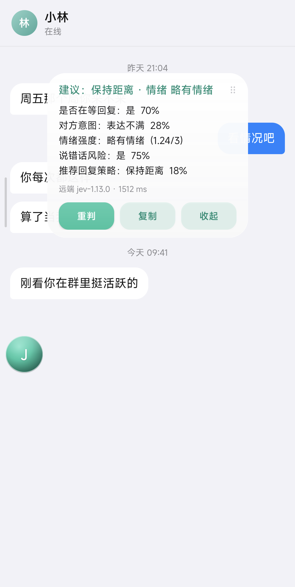

# Jev QQ Assist

**基于 Jev 的 QQ 聊天决策辅助。** 装在手机里的聊天参谋：读当前聊天窗口的文字，交给决策模型给出一组**类型化判定**——对方是不是在等你回、他想要什么、情绪多强、这句随便回会不会把事情弄糟、该用哪种策略回。

它只给判决，不替你打字。

**→ [下载 APK](https://github.com/1104480426-hash/jev-qq-assist/releases/latest)** · 装到手机上就能用，不需要电脑、不需要编译

<sub>English: An on-device chat co-pilot for QQ, built on Jev's "System One" idea — typed decisions with confidence instead of generated prose. Reads the chat window via Android Accessibility (read-only, never sends), judges locally with a quantized ONNX model or remotely against the real TypeSafe Jev endpoint, and shows a floating verdict card over the chat. No messages are ever sent for you. Grab the APK from Releases — no toolchain required.</sub>

---

## 它是什么

[TypeSafe AI 的 Jev](https://typesafe.ai) 是一个 "System One" 决策模型：它不写文章，只做**分类、路由、打分**。你给它一段状态和一组带类型的提问（`noul` 是非判断、`choice` 是单选、`score` 是量表），它一次前向就返回全部答案和每个答案的置信度。

Jev 官方是闭源托管服务，**不能本地部署**。它也没有一个开箱即用的聊天客户端。

这个项目要解决的问题很具体：**在手机上跟人聊天时，我需要一个不啰嗦、只给判决的参谋。** 于是它复现了 Jev 的产品形态，而不是它的权重：

- 输入是一段真实的聊天记录，被判定文本始终留在设备上；
- 输出是类型化判定 + 校准过的置信度，**没有一段生成式回复**，因此也没有幻觉需要分辨、没有文本需要解析；
- 判定结果浮在聊天界面上，决定权仍然在人手里。

## 它不是什么

- **不是 QQ 机器人。** 没有服务端、不接 OneBot、不登录账号、不代收发消息。它是一个前台服务加一个无障碍服务，只读屏幕。
- **不是官方 Jev，也不声称复现了它的精度。** 本地模式的判定内核是 `bge-small-zh-v1.5` 的句向量相似度（见下文），和 TypeSafe 的模型没有任何关系。
- **不会自动回消息。** 代码里没有任何一处发送路径。

## 效果



*演示模式下的截图。背景是应用内置的虚构对话页（[`docs/demo-chat.html`](docs/demo-chat.html)），不含任何真实聊天内容——做法是在 App 里打开「查看演示模式」，让读屏读到这一页，再点悬浮球。*

在一台小米 14（Android 16 / Snapdragon 8 Gen 3 / arm64-v8a）上的实测：

| 指标 | 本地模式 | 远端模式（官方 Jev） |
|---|---|---|
| 结果延迟 | 49 – 64 ms | 约 870 ms |
| 模型加载 | 432 ms（一次性） | 无 |
| APK 体积 | 22.6 MB | 同 |
| 需要网络 | 否 | 是 |
| 需要 API key | 否 | 是 |

同一段对话的两次判定对比（对方说「我在办公室没有带平板」）：

```
本地 bge-small-zh                       远端 jev-1.13.0
─────────────────────────────────       ─────────────────────────────────
是否在等回复：否  27%                     是否在等回复：是  92%
对方意图：闲聊搭话  30%                    对方意图：表达不满  47%
情绪强度：明显不快  (1.63/3)               情绪强度：明显不快  (1.63/3)
说错话风险：是  64%                       说错话风险：是  85%
推荐回复策略：稍后再说  41%                推荐回复策略：共情安抚  55%
```

**质量差距是真实的，要说清楚。** 官方 Jev 在同一批样本上给的情绪判定明显更贴（它把一段平静的闲聊判成 `calm 0.88`，本地模型会误报「明显不快」），置信度也更有区分度。本地模式的价值在于**离线、零成本、数据不出手机**，不在于它更准。两者在 App 里可随时切换。

## 工作原理

```
QQ 聊天窗口
   │  AccessibilityService 读取节点文本
   │  按气泡的屏幕横坐标推断说话人（左=对方，右=我，中间不加前缀）
   ▼
对话转录（最近 N 行，默认 12，可调）
   │  点击悬浮球触发；全程只读，不注入文本、不点发送
   ▼
┌──────────────────────┬────────────────────────────────┐
│ 本地模式              │ 远端模式                        │
│ bge-small-zh-v1.5    │ POST {endpoint}                │
│ ONNX int8 → 512 维    │ model / state / questions      │
│ 候选向量预编码并缓存   │ 即 Jev 的 /v1/systemone 契约    │
│ 余弦相似度 → softmax  │                                │
└──────────────────────┴────────────────────────────────┘
   ▼
noul / choice / score 三种答案 → 悬浮卡片
```

本地模式的方法是 Jev「读 logits、不生成文本」的一个近似：**一个问题的所有候选里，语义上最贴近当前上下文的那个胜出**，softmax 给出可比较的概率。候选描述在判定前一次性全部编码并缓存，所以真正判定时只算一次上下文向量，这是它能跑进 50 ms 的原因。

## 安装

到 [Releases](https://github.com/1104480426-hash/jev-qq-assist/releases/latest) 下载 `jev-assist-v1.0.0.apk`，在手机上点开装上就行。**不需要电脑、不需要 Android SDK、不需要编译。**

- Android 8.0 及以上（arm64-v8a），22.6 MB
- **模型已经打进 APK 里**，装完离线可用
- 用调试密钥签名，安装时系统会提示来源不明，允许即可

**装好后授权两项**（系统不允许 App 静默拿到，界面上各有一个按钮引导）：

1. **悬浮窗权限** —— 需要「显示在其他应用上层」。
2. **无障碍服务** —— 打开「Jev 聊天参谋」，用于读取聊天窗口文字。它只读：不注入输入、不点击发送、不代发任何消息。

想先确认装好了没有，点「查看演示模式」：它用一段内置的虚构对话把整条链路跑一遍，不碰任何真实聊天记录，也方便自己截图发帖。

**默认走远端**（TypeSafe 官方端点），因为它的判定质量明显更好。没填 API Key 时会自动降级用手机里的本地模型，填上之后自动切回远端——所以刚装好、手上没有 key，也能立刻试。API Key 只写进设备的 SharedPreferences，不进源码、不进仓库。

然后切到聊天窗口停一下，点悬浮球，卡片给出判定。

卡片是照着「边聊边看」调的：**默认落在屏幕上方**（最新消息在底部，压住它最难受），按住顶部那一条可以拖走，位置会记住，**点卡片外面就收起**。球拖到哪就停在哪，松手会自动吸到最近的侧边，不会赖在聊天区中间挡字。判定在跑的时候标题会动，因为本地模型首次加载要几秒。

判定结果可以点「复制」拿走。API Key 不会回填到设置界面上——那个页面很容易被截图，字段留空即表示沿用已保存的值。

## 从源码构建

想改判定描述、换模型或自己接一个后端时用这条路。

**要求**：Windows、Android SDK（build-tools 34、platform android-34）、JDK 17、Python 3。**不需要 Gradle。**

```powershell
git clone https://github.com/1104480426-hash/jev-qq-assist.git
cd jev-qq-assist

# 1. 拉第三方依赖（模型 + ONNX Runtime，不随仓库分发）
powershell -ExecutionPolicy Bypass -File fetch_deps.ps1
# 国内网络加代理：
# powershell -ExecutionPolicy Bypass -File fetch_deps.ps1 -Proxy http://127.0.0.1:7897

# 2. 构建并安装
powershell -ExecutionPolicy Bypass -File build.ps1 -Clean -Install
```

SDK / JDK 不在默认位置时：`build.ps1 -Sdk <path> -Jdk <path>`，或设置 `ANDROID_HOME` / `JAVA_HOME`。

## 判定集

| 键 | 类型 | 判定内容 |
|---|---|---|
| `awaiting_reply` | `noul` | 对方是否正等你回复（不回会被读成已读不回） |
| `intent` | `choice` | 对方意图：提问 / 邀约 / 倾诉 / 抱怨 / 闲聊 / 试探 / 想结束 |
| `tension` | `score` 0–3 | 情绪强度：平静 → 略有不快 → 明显不快 → 已经很生气 |
| `risk` | `noul` | 随便回一句是否容易把事情弄糟 |
| `strategy` | `choice` | 建议策略：共情安抚 / 说明情况 / 幽默化解 / 直接回应 / 稍后再说 / 保持距离 |

远端模式的 questions 用英文（TypeSafe 官方文档明确英文训练最充分，CJK 属于 "handled but not equally well"）；本地模式用中文，因为句向量模型是中文优化的。两套规格共用同一个渲染层。

## 技术要点

### 纯 Java 的 BERT 分词器，经过对拍

`BertTokenizer` 不用任何 native 依赖，行为对齐模型自带的 `tokenizer.json`：不转小写、不剥离重音、中文逐字切分、`[CLS]A[SEP]` 模板。

它和 HuggingFace 的 tokenizer 做过逐 id 对拍，覆盖中英混排、标点、全角符号、emoji 代理对，**10/10 完全一致**：

```powershell
javac -encoding UTF-8 -d tools/out tools/TokenizerProbe.java app/src/ai/jev/assist/BertTokenizer.java
java "-Dfile.encoding=UTF-8" -cp tools/out ai.jev.assist.TokenizerProbe app/assets/models/bge-small-zh/vocab.txt tools/probe_java.txt
python tools/probe_py.py
```

> 注意 `tokenizer_config.json` 必须和 `tokenizer.json` 一起在场。缺了它，transformers 会用 `BertTokenizerFast` 的默认 `do_lower_case=True`，而官方配置是 `false`——对拍会因此报出并不存在的差异。这个坑当时真的踩了。

### 两个构建期的坑

**assets 不能用 aapt2 的 `-A` 打包。** Windows 上 aapt2 用反斜杠生成条目名（`assets/models\bge-small-zh\x.json`），整条路径被当成一个文件名，`AssetManager.open()` 必定抛 `FileNotFoundException`。本项目改由 `pack_apk.py` 用正斜杠写入资产。

**悬浮球尺寸要在代码里定死。** `inflate(R.layout.x, null)` 会丢掉 XML 根节点的 `layout_width/height`，只靠 `wrap_content` 会让球被挤成 25×68 像素，肉眼几乎看不见。`OverlayService` 里显式设置像素尺寸。

## 已知限制

- **本地模式的细粒度判定会飘。** 句向量相似度对「情绪强度」这种连续量不敏感，把平静的对话误报成不快的概率不低。粗分类（是否在等回复、有无风险）相对可靠。想要质量就用远端模式。
- **说话人靠屏幕横坐标猜。** 只在气泡左右分栏的布局下准确；居中气泡、引用回复、系统消息都会让它判断失准。
- **判定是基于当前屏幕文本的。** 如果聊天窗口只加载了最近几条，判定就只看到这几条。
- **只适配竖屏手机 QQ。** 其他聊天软件（微信、TIM）理论上可用，但没有做过验证。
- **不做历史积累。** 每次判定都是独立的一次，没有跨会话的上下文或记忆。

## 隐私

- 读屏服务**只读**：它遍历当前窗口的节点取文本，不执行任何 action，不注入输入，不点击发送。
- **本地模式的数据完全不出手机**，判定在设备内完成。
- **远端模式**会把最近 N 行对话作为 `state` 发给所配置的端点（默认是 TypeSafe 官方）。用之前请确认你接受这一点，并按需改成自建服务。
- 本项目不收集任何遥测。

## 关于 Jev

[Jev](https://docs.typesafe.ai) 由 TypeSafe AI 开发。本项目和 TypeSafe AI 没有任何关系，未经其背书，也没有使用其权重。远端模式之所以能工作，是因为它实现了 Jev 公开的 `POST /v1/systemone` 接口契约。

相关开源生态可参考 [awesome-jev](https://github.com/ckaraca/awesome-jev)，以及本项目的判定思路来源：[khimaros/verdict](https://github.com/khimaros/verdict)（用 llama.cpp 读 logits）、[githubnext/localjev](https://github.com/githubnext/localjev)（把判定翻译成分类 prompt）、[Heman10x-NGU/Verdict-open-jev](https://github.com/Heman10x-NGU/Verdict-open-jev)（151M NLI 框架的判定模型）。

## 第三方组件

| 组件 | 版本 | 许可 | 用途 |
|---|---|---|---|
| [ONNX Runtime](https://github.com/microsoft/onnxruntime) | 1.20.0 | MIT | 设备端推理 |
| [bge-small-zh-v1.5](https://huggingface.co/BAAI/bge-small-zh-v1.5) | — | MIT | 中文句向量（ONNX int8 导出取自 [Xenova](https://huggingface.co/Xenova/bge-small-zh-v1.5)） |

两者都由 `fetch_deps.ps1` 下载，不随仓库分发。

## License

MIT，见 [LICENSE](LICENSE)。
